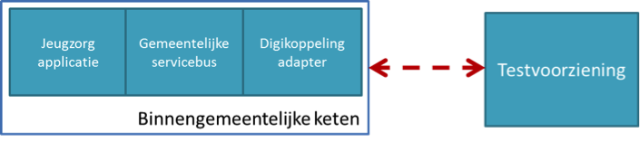
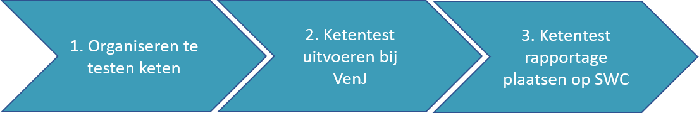

# Compliancy StUF-koppelvlak Jeugdzorg (CORV)

| Documentversie | Datum     | Status    |
|----------------|-----------|-----------|
| 1.0            | 4-10-2019 | final     |

## Revisie historie

| Versie | Datum      | Reden en aard wijziging                                                            |
|--------|------------|------------------------------------------------------------------------------------|
| 1.0    | 01-11-2013 | Afronding en consistent met de ingerichte scenario’s op StUF Testplatform.         |
| 1.0    | 6-11-2015  | Definitieve versie bij StUF jeugdzorg 1.0.1                                        |
| 1.0    | 4-10-2019  | Aangepast naar de, in het kader van dit koppelvlak, gewijzigde functie van het STP |

## Inleiding

Voor de sturing op kwalitatief goede inbouw van standaarden in
softwareproducten zijn compliancy instrumenten ontwikkeld. Dat heeft als
doel interoperabiliteitsproblemen tussen applicaties bij gemeenten
preventief te verminderen. De volgende sectie beschrijft de eisen
waaraan een softwareproduct moet voldoen wat compliant is aan deze
standaard. VNG-Realisatie adviseert gemeenten bij aanschaf van software
die moet voldoen aan deze standaard gebruik te maken van de GIBIT.
Daarin zijn voorwaarden opgenomen over het gebruik van compliancy
instrumenten. Door het sluiten van een overeenkomst waarop de GIBIT van
toepassing is, worden ook de [Gemeentelijke ICT
Kwaliteitsnormen](https://vng.nl/projecten/gibit)
automatisch van kracht. Wat betekent dat onder de GIBIT ingekochte
producten of diensten aan de Kwaliteitsnormen moeten voldoen.  
Onderstaande beschrijving definieert de compliance eisen voor
koppelingen die gebaseerd zijn op het StUF Jeugdzorg koppelvlak 1.0
(CORV).

### Wanneer is een softwareproduct compliant

Een softwareproduct is compliant aan de StUF Jeugdzorg koppelvlak (CORV)
1.0 (\*), indien aan alle onderstaande eisen wordt voldaan:

| Nr  | Eis                                                                                                                          |
|-----|------------------------------------------------------------------------------------------------------------------------------|
| 1   | Het betreffende softwareproduct is getest conform de eisen en voorwaarden uit onderliggend document inclusief de bijlagen en |
| 2   | Er heeft een foutloze ketentest plaatsgevonden op de Ketentestplatform (KTP) van VenJ.                                       |
| 3   | Finale en authentieke testrapporten van de ketentest (stap 2) zijn openbaar en beschikbaar via de GEMMA Softwarecatalogus.   |

(\*) Hoewel een foutloos testresultaat van deze testset geen absolute
zekerheid geeft van 100% interoperabiliteit tussen applicaties, geeft
dit wel een goede indicatie van de kwaliteit van de ondersteuning van de
standaard. Compliance wordt als voorwaarde gesteld om aan te mogen
sluiten op de productieomgeving van de CORV.

## Aantonen compliance

Softwareproducten die compliant zijn aan de StUF Jeugdzorg koppelvlak
standaard moeten gekoppeld kunnen worden aan de landelijke CORV. Binnen
de standaard worden twee referentiecomponenten onderscheiden die nodig
zijn om aan te kunnen sluiten op de CORV. Dit zijn Jeugdzorgapplicatie
(JZA) en een Digikoppeling adapter (DKA). Daarnaast wordt ook de
Gemeentelijke servicebus (GSB) genoemd om berichten te routeren. De CORV
standaard stelt geen specifieke eisen aan de GSB. Applicaties die
invulling geven aan zowel de JZA en de DKA kunnen zelfstandig compliancy
aantonen. Wanneer deze referentiecomponenten door verschillende
softwareproducten worden ingevuld dan kan compliancy alleen aangetoond
worden voor deze combinatie van softwareproducten. Bij het uitvoeren van
de compliancy testen wordt deze combinatie van softwareproducten, de
binnengemeentelijke keten, als één geheel gezien. Er worden geen tests
uitgevoerd op koppelingen binnen deze keten.

Figuur 1: Binnengemeentelijke keten wordt gezien als één geheel tijdens
uitvoer van de compliancy testen

### Teststappen

Om compliance op StUF Jeugdzorg koppelvlak aan te tonen moeten vier
stappen doorlopen worden. Deze staan weergegeven in figuur 2.

Figuur 2: Te doorlopen stappen om compliance aan te tonen

Elk van de stappen wordt in de volgende paragrafen toegelicht.

#### Organiseren te testen keten

De leverancier van de Digikoppelingadapter heeft de verantwoordelijkheid
dat alle softwareproducten van de te testen keten correct gekoppeld zijn
om de testen uit te voeren. Deze leverancier verzorgt tevens de
koppeling met de ketentest voorziening (stap 3).

#### Ketentest uitvoeren bij VenJ

Nadat alle softwareproducten correct gekoppeld zijn kan gestart worden
met de ketentest bij het ministerie van VenJ.

Elke leverancier dient zich vooraf aan te melden door [het daarvoor
bestemde forumulier](documenten/Formulier_Aansluiting_CORV_Acc_v20170821.pdf)
naar Justid te sturen. Hoe u dat doet vindt u in [dit
document](documenten/20180910-CORV-KTP-Informatieblad.pdf). In
hetzelfde document vindt u ook een handleiding met een beschrijving van
de wijze waarop u het Keten Testplatform kunt gebruiken.

Bij een foutloze ketentest wordt een ketentestrapportage verstrekt. Op
deze rapportage staat vermeld welke softwareleveranciers hebben
deelgenomen aan de test en met welke softwareproducten (inclusief
versie) ze de test hebben uitgevoerd.

#### Publicatie op GEMMA Softwarecatalogus

De ketentestrapportage van VenJ moet geplaatst worden op de GEMMA
Softwarecatalogus en geeft aan dat een softwareproduct(versie) compliant
is aan de StUF-koppelvlak Jeugdzorg-standaard. Het testrapport mag
opgevoerd worden bij softwareproducten (incl. versie) die op het rapport
genoemd zijn. Oftewel, de naam en versie van het softwareproduct zoals
vermeld in de Softwarecatalogus moet volledig overeen komen met één van
de softwareproductnamen (incl. versie) die op het ketentestrapport staan
vermeld.

## Testen van gemeentelijke implementaties (on premise)

Het is niet mogelijk om testen uit te voeren op de productieomgeving van
CORV. VenJ hanteert het beleid dat er slechts onder zeer strenge
voorwaarden informatie uit productiesystemen mag worden verwijderd. Om
toch deels tegemoet te komen aan de wens om vanuit een gemeentelijke
on-premise-installatie testen uit te voeren, is het mogelijk om de
on-premise-installatie (JZA incl. DKA) vanuit de gemeentelijke
acceptatieomgeving te testen op het Keten Testplatform. Deze
testmogelijkheid kan desgewenst ook worden gebruikt door
SAAS-oplossingen om te toetsen of de berichtuitwisseling nog werkt. Deze
testen maken geen onderdeel uit van de compliancytest.

## Gebruik van het StUF Testplatform

Het StUF Testplatform is een onafhankelijk en formeel toetsinginstrument
voor het testen van koppelingen gebaseerd op standaarden uit de StUF
familie. Het platform is vanaf eind 2011 in productie en wordt beheerd
en doorontwikkeld door VNG-Realisatie.

Primair is het StUF Testplatform voor ICT softwareleveranciers die
werkzaam zijn op de gemeentelijke markt. Zij kunnen vroegtijdig tijdens
de ontwikkeling van software testen of applicatie-applicatiekoppelingen
voldoen aan StUF. T.b.v. het StUF-koppelvlak Jeugdzorg wordt het StUF
Testplatform niet ingezet als toetsingsinstrument. Wel kunnen
Leveranciers het StUF Testplatform gebruiken om individuele berichten te
valideren. Daarmee is het een tool dat ontwikkelaars helpt bij het
ontwikkelen van de noodzakelijke berichten.

Op het [StUF Testplatform](http://www.stuftestplatform.nl) vindt u de
[handleiding](./documenten/Gebruikershandleiding_StUF_Testplatform.pdf)
waarin wordt toegelicht hoe het testplatform gebruikt kan worden.

## Bijlage 1: Testscenario’s StUF Testplatform

Zie de
[documentatie](./documenten/Testset_StUF-koppelvlak_Jeugdzorg_1.0.1.zip)
bij deze testset.
