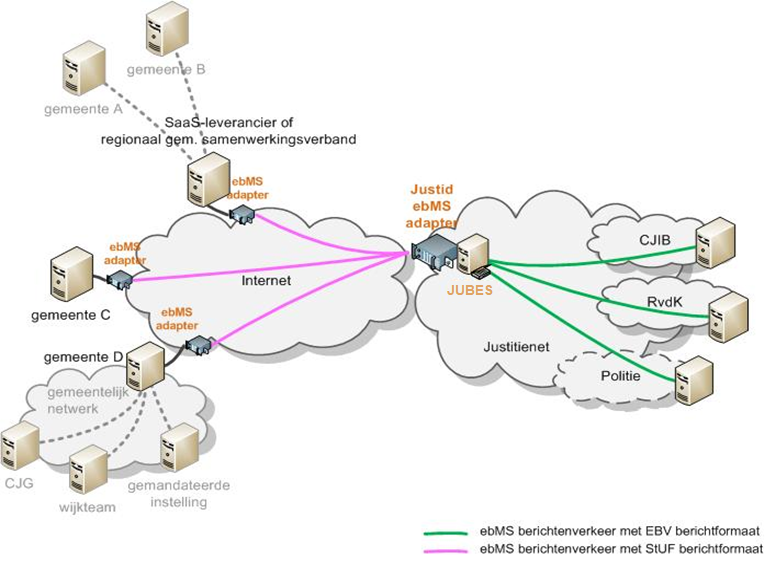

# Techniek StUF-koppelvlak Jeugdzorg

Op basis van het koppelvlak communiceren gemeenten (en Veilig Thuis organisaties) elektronisch met andere ketenpartijen. 
Deze communicatie verloopt via JUBES als knooppunt (in beheer bij JustID). Het jeugdzorg-koppelvlak is gebaseerd op StUF. 
Andere partijen communiceren op basis van een ander uitwisselformaat: EBV (Elektronisch Berichtenverkeer). 
JUBES verzorgt de vertaling van StUF naar EBV vice versa. Dit is in onderstaande figuur gevisualiseerd.

Met het oog op beveiligd berichtenverkeer verloopt de elektronische communicatie 'over' ebMS. 
Hierin is het StUF-bericht 'verpakt en versleuteld' t.b.v. veilige verzending naar en ontvangst van JUBES. 
Hiertoe staat er een ebMS- of DigiKoppeling-adapter tussen de jeugdzorgapplicatie en het internet dat de berichten transporteert van en naar JUBES. 
Ook deze adapter moet het StUF Jeugdzorg koppelvlak ondersteunen. Zie de [GEMMA Softwarecatalogus](https://www.softwarecatalogus.nl/pakketten/referentiecomponent_pakket/Digikoppeling%20adapter) voor informatie.

